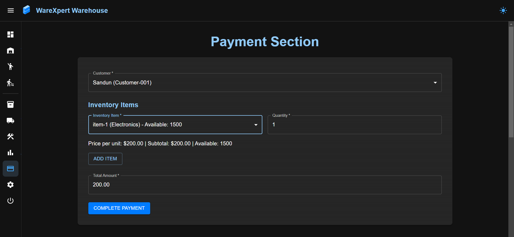

<a href="https://git.io/typing-svg"></a>

<p align="center"></p>

<p id="description">Warexpert frontend is a modern user-friendly warehouse management system built with React TypeScript and Vite. This frontend application provides a comprehensive interface for managing warehouses inventory equipment staff and logistics operations.</p>

<h2>Project Screenshots:</h2>





  
  
<h2>🧐 Features</h2>

Here're some of the project's best features:

*   User Authentication - JWT Secured sign-in sign-up and OTP verification
*   Dashboard Analytics - Visual data representation with charts and metrics
*   Warehouse Management - Create view edit and delete warehouses with image support
*   Inventory Tracking - Monitor stock levels locations and movements
*   Equipment Management - Track and manage warehouse equipment
*   Staff Management - Assign staff to warehouses and track responsibilities
*   Transportation Logistics - Manage transportation and delivery systems
*   Toast Notifications - User-friendly feedback system using Sonner

<h2>🛠️ Installation Steps:</h2>

<p>1. Clone the repository</p>

```
gitclone https://github.com/sandundil2002/Warexpert_Frontend.git
```

<p>2. Install dependencies</p>

```
npm install # or  yarn install
```

<p>3. Start the development server</p>

```
npm run dev # or yarn dev
```

<p>4. Open your browser and navigate to</p>

```
http://localhost:5173
```

  
  
<h2>💻 Built with</h2>

Technologies used in the project:

*   React 18 with TypeScript
*   Vite for fast development and optimized builds
*   React Router v7 for navigation
*   Redux Toolkit for state management
*   Material UI and Tailwind CSS for responsive UI design
*   Axios for API communication
*   Recharts for data visualization
*   Sonner for toast notifications

<h2>Backend REST API Repository</h2>

  * For the backend implementation of this project, you can visit the repository <a href="https://github.com/sandundil2002/Warexpert_Backend.git">Warexpert Backend API</a>

  
<h2>🛡️ License:</h2>

This project is licensed under the MIT License - see the LICENSE file for details.
